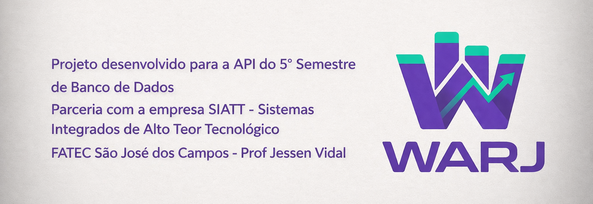

<div align="center">
  

  # API5BD2026 - Frontend

  [](https://ui.nuxt.com)
  [](https://vuejs.org/)
  [](https://developer.mozilla.org/en-US/docs/Web/JavaScript)
  [](https://typicode.github.io/husky/)
  [](https://sonarcloud.io/summary/new_code?id=Warj-Group_API5BD2026Frontend)
</div>

<br>

## Environment Setup

Clone the repository to your local environment and use your preferred IDE (VS Code or WebStorm recommended):

```bash
git clone https://github.com/Warj-Group/API5BD2026Frontend.git
```

### Initial Configuration
Run the automation script to install dependencies and configure Husky hooks:

* **Windows:** `setup-warj.bat`
* **Linux/Mac/Git Bash:** `bash setup-warj.sh`

### Execution
Start the development server:

```bash
npm run dev
```

The project will be available at: `http://localhost:3000`

<br>

## Development and Quality

To maintain code consistency and quality according to DevOps principles, we use ESLint for static analysis.

* **View errors:** `npm run lint`
* **Fix errors automatically:** `npm run lint:fix`

<br>

## Contribution Guidelines

To ensure traceability between YouTrack tasks and GitHub commits, strictly follow the standards below:

### 1. Commit Messages
Messages must use the task ID for automatic integration with YouTrack:
* **Format:** `{type}/{yt_id}: Description`
* **Example:** `feat/WARJ-1: implement product grid`

### 2. Branch Naming Convention
Create working branches linked to the sprint cards:
* **Format:** `{type}/{yt_id}-brief-description`
* **Example:** `feature/WARJ-1-product-grid`

### 3. Automatic Validation
The project uses Husky and Commitlint. If the commit standard or linting rules are not followed, the submission (push/commit) will be blocked by the terminal with the appropriate correction instructions.

<br>

## Additional Documentation
For details on the group's architecture, CI/CD, and design patterns, access our Wiki: [WARJ-GROUP - Wiki Documentation](https://github.com/Warj-Group/API5BD2026Main/wiki)
